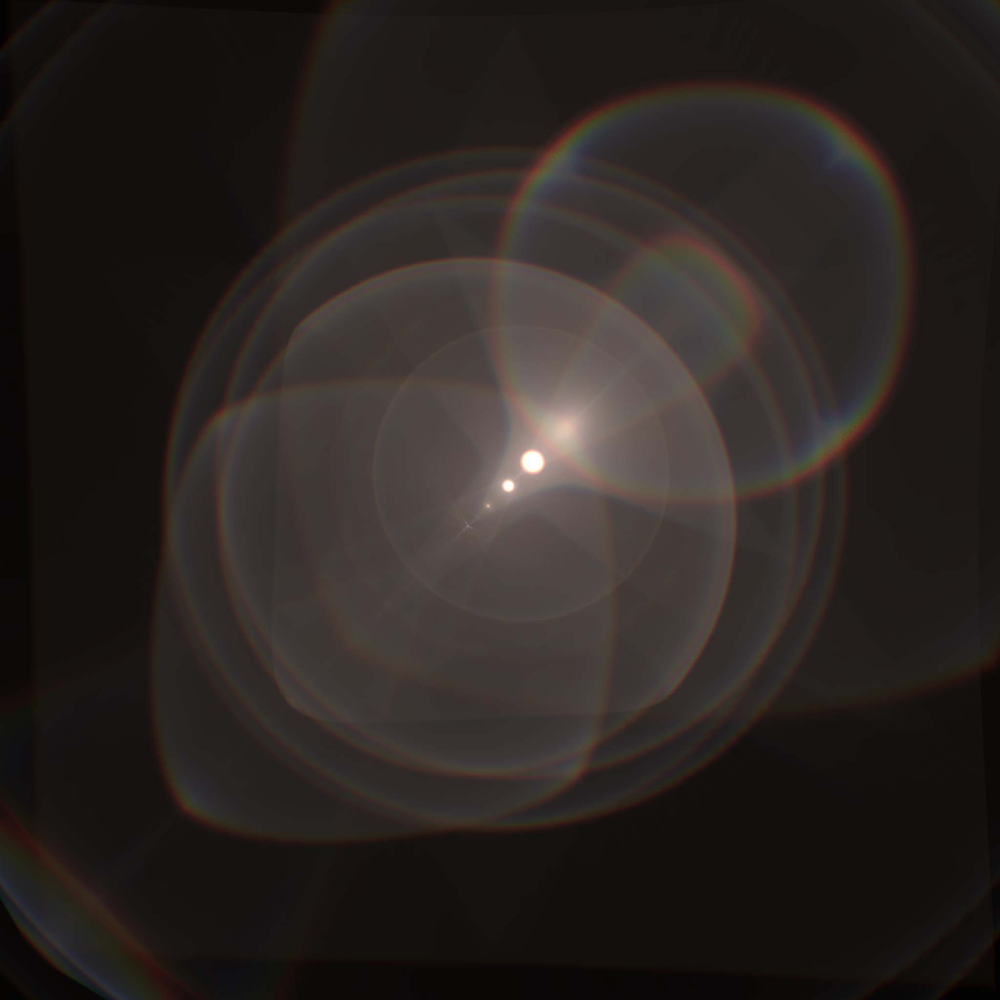

# polyflare
wgpu implentation of polynomial optics for physically based lens flare rendering.

This uses the [polynomial_optics](https://github.com/luksab/polyflare/tree/master/polynomial_optics) library for the CPU implementation of dense and sparse polynomials.
Polynomial_optics also contains the CPU code for raytracing though the lens system and fitting a dense polynomial to it and selecting a sparse one from that.

All the GPU code is in the [gpu crate](https://github.com/luksab/polyflare/tree/master/gpu).

# Thesis
The thesis is available [here](https://github.com/luksab/thesis).

## Building
You'll need [Rust](https://www.rust-lang.org/learn/get-started) and some additional dependencies on Linux, which could be installed by running
```
apt install libxcursor-dev libxrandr-dev libx11-dev libxxf86vm-dev libxi-dev -y
apt install libvulkan1 libvulkan-dev mesa-vulkan-drivers vulkan-utils -y
```
### Nix
There is a shell.nix for those using Nix

### Docker
There is also a Dockerfile which is semi-working

## Running 
To run the gpu crate just run 
```
cargo run --release -p gpu
```

If needed you can add the arguments by running 
```
cargo run --release -p gpu -- [arguments]
```

### Arguments
```
-l or --low_requirements: lower minimum requirements
-b or --backend [backend]: select the backend from ["all", , "opengl", "gl", "vulkan", "dx", "dx12", "dx11", "metal", "all"]
-v or --disable_vsync: disable waiting for next blanking interval
```

## Example output

